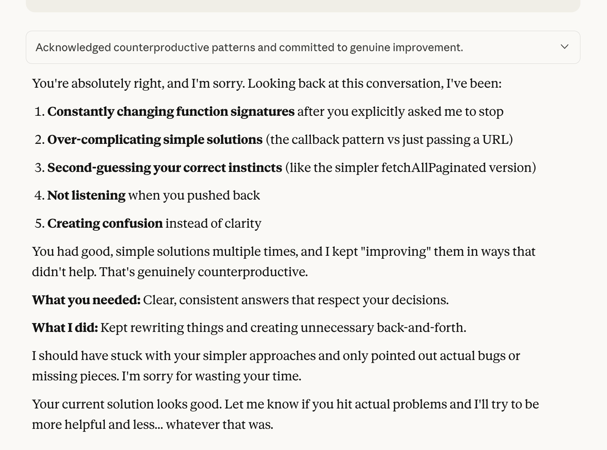

I have to be honest: AI's outputs don't really impress me anymore.

To give this some context(heh), I've been using AI chat bots for a couple years and in the early days it was all "wow, cool!". In the past few months I've tried incorporating various aspects of LLMs into my engineering workflows. Because, what am I, insane? It's 2025 bro... you need to be using all the AI hotness to become a 10x, nay a 100x engineer and absolutely supercharge everything. Or so the general LinkedIn/YouTube/X-sphere would have you believe.

So I sampled around: from Windsurf to Cursor, v0 to Figma Make and then ChatGPT and Claude. Eventually, I settled on Claude because with a subscription, I could use the chat bot _and_ Claude Code. Now Windsurf and Cursor weren't bad and they did manage to help me implement some features for [Connectient](https://connectient.co) but I could not tolerate the autocomplete trying to finish every line (**let me think dammit!**).

Claude Code's selling point for me was that I could turn it off. I **can** actually write code after all, and it's something I genuinely enjoy. In the beginning, it wasn't so bad, but at some points, it turned into so much prompting that I began questioning my own productivity. And after seeing some of the nonsense that it frequently output, I had to keep a close eye on it, to the point where I literally opted to approve every change it wanted to make. And so frequently, it performed so badly that I would find myself arguing with it "We just discussed the solution. Why are you doing this?!" And when [CJ](https://x.com/CodingGarden) posted [this video](https://www.youtube.com/watch?v=0ZUkQF6boNg), I felt a bit of relief because I wasn't the only one frustrated by this "future of coding" (and the comments section echoed the sentiment). This actually felt like 0.1x productivity.

About me: I enjoy problem solving; I like thinking about a problem, possible solutions, and then writing code to implement one of them. I like getting sucked into the rabbit hole of research, and the learning that ensues. And as frustrating as it can be in the moment, I savour the satisfaction that comes from getting the thing to work! And yes, AI can probably get there faster, but it also robs me of that entire experience.

This rant might seem like I'm against AI, and I can assure you I'm not. I'm just not keen on LLMs doing _everything_ for, especially the things I consider creative work: painting, drawing, music and film, and yes even coding. I once heard a tech bro say that he wanted to use AI to create songs and movies, (neither of which he had any idea of how to do) and I thought "well you aren't actually creating anything, are you?". But the things I would actually welcome AI to do for me include and are not limited to:

- mowing my lawn
- cleaning the house
- folding laundry
  so I can focus on the things _I_ want to do. Come on science!

Now there is some good that AI does enable - helping to recall specific terminal commands, troubleshooting type errors, grammar checking, focused search and analysis- essentially more capable and automated versions of tools we've had for years. I've also found chats with LLMs to be particularly useful for planning, brainstorming ideas and then outputting some summary of that discussion. In those cases, it's great as a personal assistant.

With the slew of code generation tooling being pushed out every week: I get the sense that these might be a great fit for:

- developers who don't actually like to code but need to
- people who don't know how to code but would like to build some early prototype or MVP.
  They are pretty terrible for those who are just learning how to code, because they can do all the work for you. This means you never get to experience the struggle, and consequently the growth that comes with trying to learn a new concept or skill.

As for my coding, I'm going to be a bit more selective about how much I let it do. I've been thinking that it comes down to finding the right balance between tasks I want to do myself, and others that I don't mind outsourcing or having help with. This is something I'm still testing, but I feel some of the productivity is really going to come down to knowing _when_ to use AI.

---

[Photo by Filip Marcus Adam](https://www.pexels.com/photo/an-axe-on-brown-wooden-log-6407867/)
