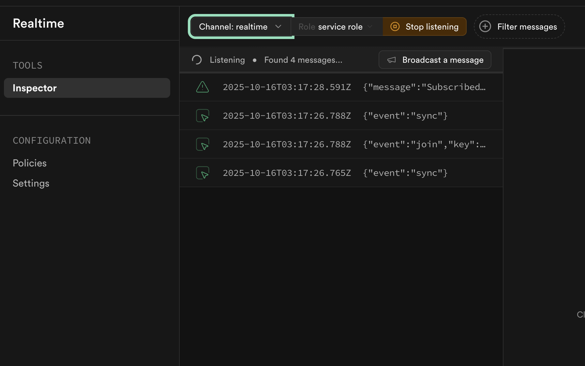
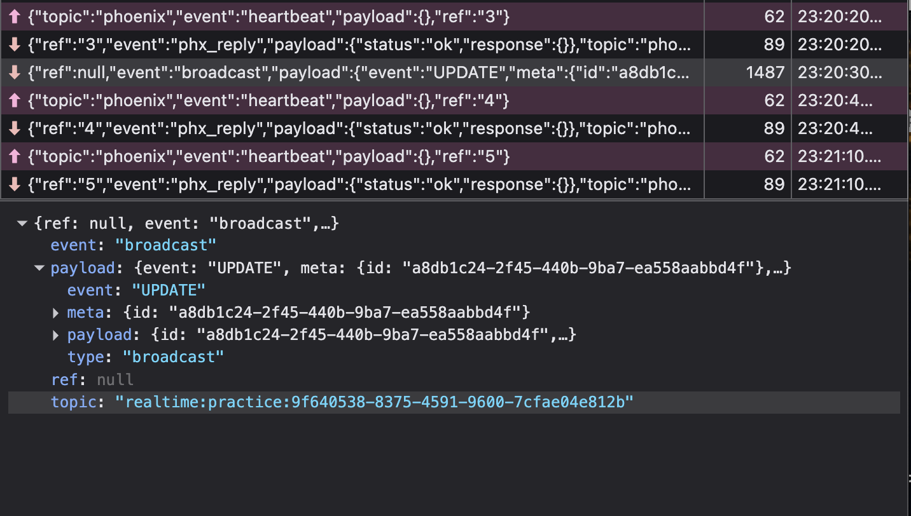

Back in 2023, before the rise of AI coding agents and endless vibes made Next.js/Supabase the default stack for all things web-app, I had actually adopted that combo to build out a project I had in mind. Supabase was being touted as the hot new open-source alternative to Firebase, and after all, it was _just Postgres_.

One of Supabase's **coolest** features was their version of Firebase's Realtime, which was also called Realtime. If you're unfamiliar, Realtime basically synchronised data between the client and the database without the need to manually re-fetch data. Under the hood it implements Websockets, and is great for many other cases such as push-notifications and real time messaging.

In [Connectient](/project/connectient), this feature was critical to the app's functionality as the dashboard users needed to be notified when a new appointment booking came in. We followed [Jon's Guides](https://supabase.com/docs/guides/realtime/realtime-with-nextjs) and everything went smoothly.

Until they didn't...

Fast forward to 2025, where we had not done much development on app, save for some minor updates. By now, Next.js had updated two _whole_ versions, and Supabase became a formidable player in the BaaS space. _Everything needed to be updated_, but we had users on the platform so some care had to be taken with this refactor. Two years of development had fixed some of Next's issues (and probably added some new ones 😝), and many experimental features had now made it to production. Supabase had also refined some of their developer tooling as the platform matured.

Supabase had made updates to their JavaScript libraries, specifically for better handling of server and client components within Next. Updating from Next.js 13 to 15 was fairly smooth with the help of Claude and GPT, and allowed for much cleaner implementation of the Supabase integration. Database requests and authentication worked without a hitch, and Realtime subscriptions? Well let's say there were many hitches involved.

Realtime no longer worked. Checking the Network connection and multiple `console.log`s later, I could see that the websocket connection was open and subscribed to, but I could not get my dev code to work. I Googled, asked Claude and other models, re-checked the docs and even let Claude Code use the Supabase MCP server to check everything from RLS to proper permissions, but to no avail. Now mind you, the _old_ 2023 code in production worked fine, so it couldn't have been the databases; it had to be with the new libraries.

Doing what AI couldn't figure out, I decided to take a look at the Realtime logs: I subscribed to the channel and watched the logs as I made requests to the database. Funny enough, the only events that were being emitted were `DELETE` events; sending `CREATE` and `UPDATE` events did nothing. With a bit more direction as to where the issue lay, it turns out that this was an [old and known issue with realtime](https://github.com/supabase/supabase-js/issues/335) that no-one (not even Supabase) managed to patch.

#### The Fix

Though not very much publicised (come on Jon!), it seems that Supabase is moving towards [Broadcast](https://supabase.com/docs/guides/realtime/broadcast) as the new way for listening to Postgres changes. Bear in mind, that their docs still refer to Realtime and talk about its implementation. And though the broadcast docs were not the greatest, the approach was:

1. Create RLS policy - Allow authenticated users to receive broadcasts from realtime.messages
2. Created trigger function - appointments_changes() broadcasts to business:${business_id} topic on any appointment change
3. Added trigger - Fires the function on INSERT, UPDATE, DELETE to the Appointments table
4. Built client component - Authenticates with setAuth(), subscribes to channel based on the business, handles INSERT/UPDATE/DELETE events

With that, "realtime" was functional again and worked the way it should. Now Supabase says some of this is still in beta, and judging by the quality of their current documentation, I am not sure what to expect. I'm glad it works and that we were able to push out the major update, but I'm **really** hoping Supabase keeps us informed about any future breaking changes.

_SUCCESS!! For now..._
