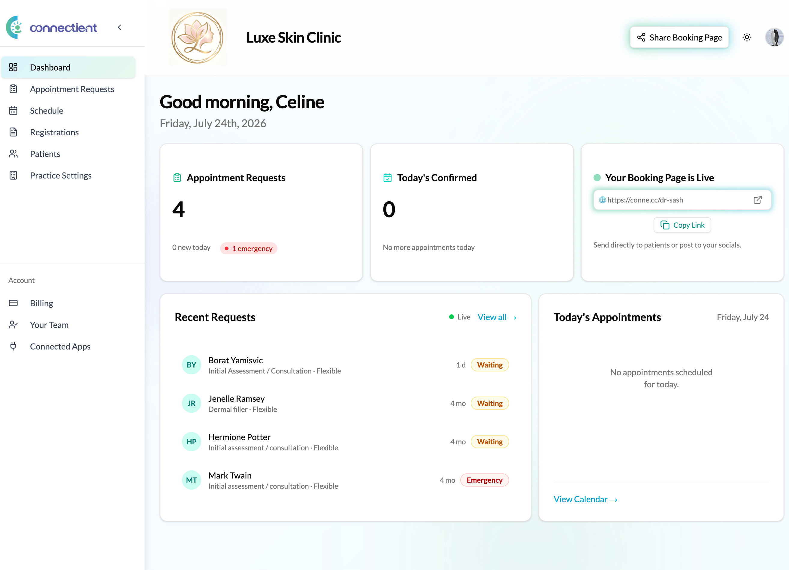
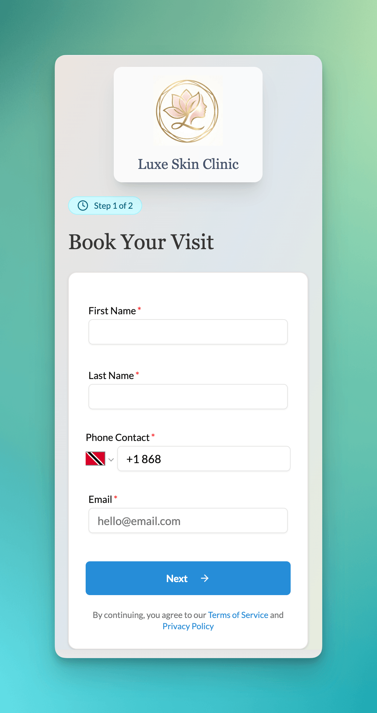
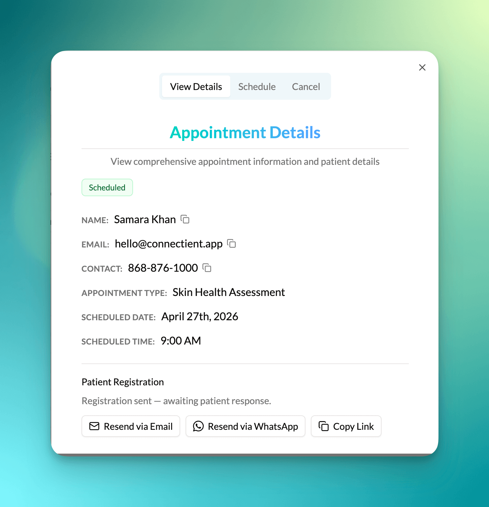

Connectient gives patients a simple, frictionless way to connect with their desired provider while providing support staff with a powerful scheduling and management tool. With a focus on user-friendly interface, robust features, and a commitment to enhancing the patient experience, Connectient bridges the gap between patients and practices.

### Key Features
- Customisable booking page with a branded short URL (conne.cc) for sharing via web and social media
- Multi-location and multi-provider practice bookings with role-based staff access
- Patient pre-registration eliminating paper intake, saving up to 15 minutes per appointment
- WhatsApp and email notifications keeping patients and staff informed automatically
- Google Calendar sync for confirmed appointments

### Accomplishments
- Serving multiple healthcare practices with over 500 appointments booked
- Capturing after-hours demand — 60% of appointment requests come in outside office hours, based on live appointment data
- Migrating core infrastructure to a self-built Go backend for long-term scalability and framework independence