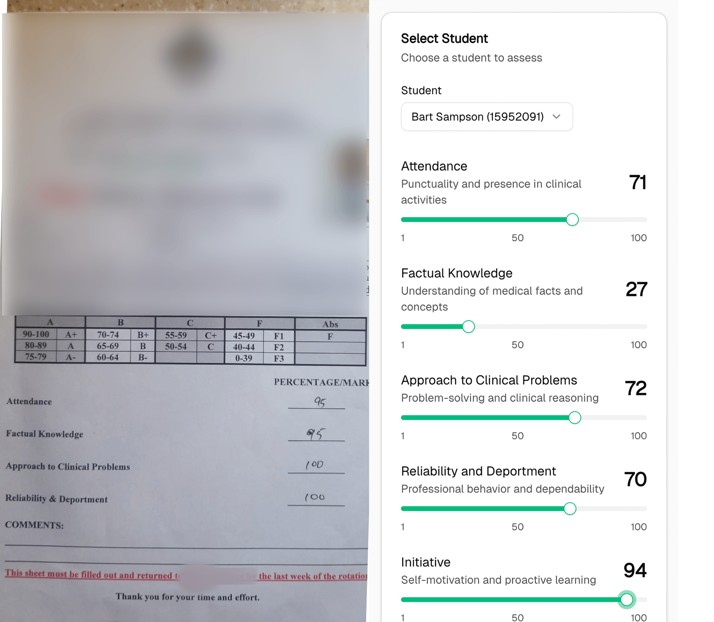
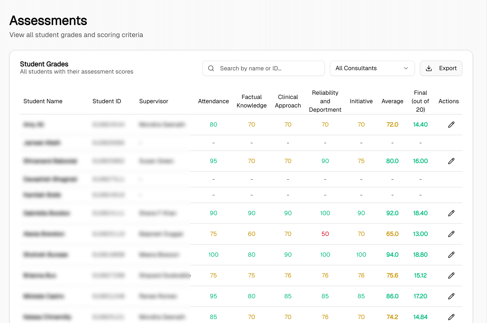

FairGrade is a medical education assessment platform built to digitize the student evaluation process for the Obstetrics & Gynaecology department at the Faculty of Medical Sciences, University of the West Indies. It smoothens the cumbersome paper-based workflow where consulting physicians had to manually fill out forms, scan them, and submit them to the lead consultant for grade compilation. 

FairGrade features a mobile-first grading interface for consultant physicians in the field and a comprehensive desktop dashboard for the lead consultant to manage students, consolidate assessments, calculate grades, and export final scores. Th e platform handles complex hierarchical data including multiple classes, groups, hospital units, and location-based assignments, with role-based permissions ensuring consultants only access their assigned students.

### Accomplishments

- Reduced the Lead Instructor workflow for manual data entry, tabulation and calculation from 4-5 hours to 5 minutes.
- Currently serving 12 Consultant Physicians evaluating 40+ medical students across 4 hospital locations, with plans to scale across additional departments throughout the academic year.