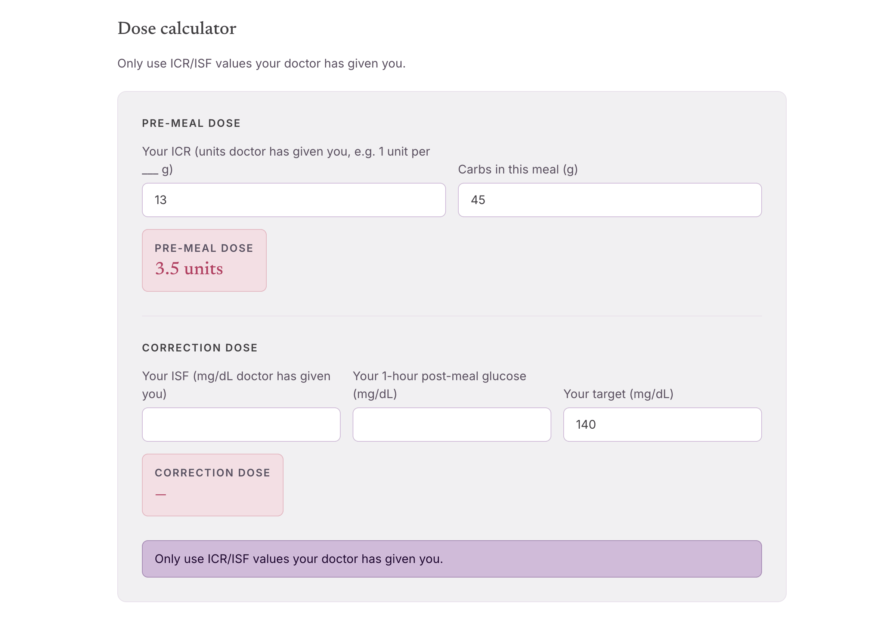

A modern, responsive patient-facing landing page for Maternal Fetal Medicine practice, Fetal Health Solutions. Features doctor's profile, patient education articles and an insulin dose calculator. Implements SEO and online bookings via [Connectient](/project/connectient).

