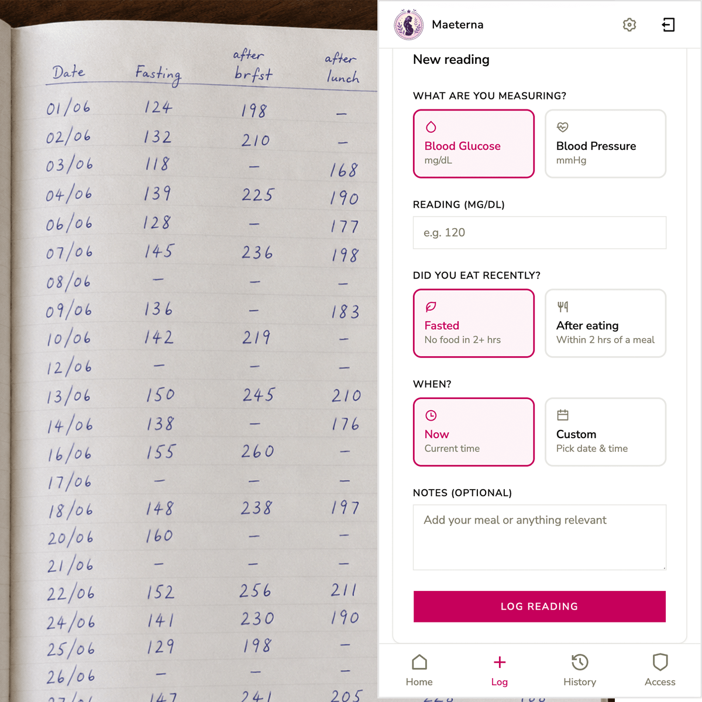
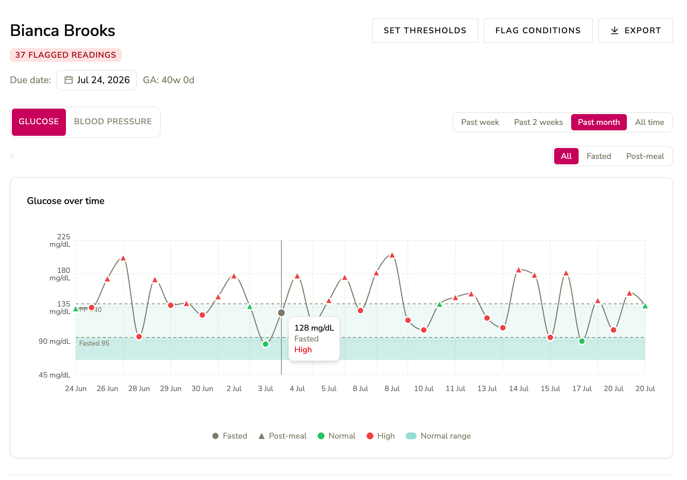
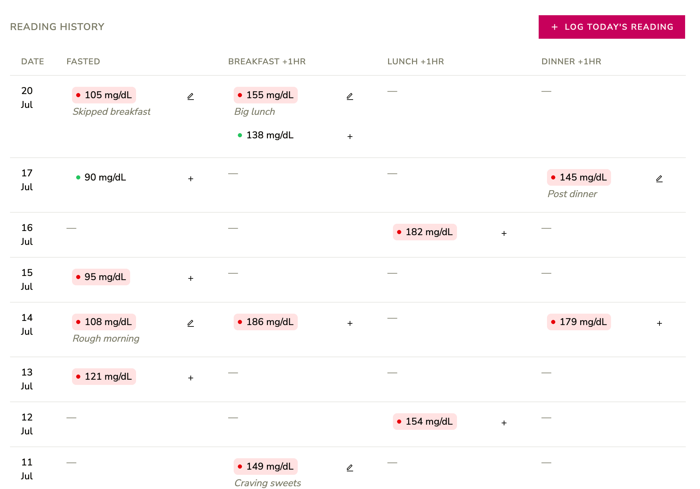

Maeterna solves a very specific problem: in Trinidad & Tobago, high risk pregnant patients usually need to log their blood glucose and blood pressure as this affects their case management. In the public health system, the way this is done is physically writing it down on paper, then booking a clinic appointment to review the values. As if a high-risk pregnancy isn't stressful enough, patients sometimes have to wait up to 3 hours to be seen.

The solution: a maternal health monitoring platform built for patients and Obstetrician/Gynaecologists in Trinidad & Tobago and the wider Caribbean. It replaces paper-based, disorganised tracking of blood glucose and blood pressure readings with a structured system where patients own their health data and explicitly control who can see it.

Co-developed with [Tiffany Hall](https://tiffanycodes.com) and [Dr. Shane Khan](https://fetalhealthsolutions.com)

Maeterna features a mobile-first interface for patients and a highly detailed dashboard for doctors which includes chart-based representation of data, automatic gestational age calculation and the ability to set patient flags.

### Key Features

- Patient-owned data & consent model — patients log glucose and blood pressure readings and explicitly grant or revoke access to individual doctors or entire hospital departments.
- Clinical dashboard for doctors: glucose and BP charts with per-reading severity colouring, shaded threshold bands, fasted vs non-fasted markers and time-range filtering.
- Glucose and BP readings organized into date-row tables (Fasted/meal columns; AM/PM columns) instead of flat chronological lists, with automatic slot assignment from reading timestamps
- Per-patient severity thresholds: doctors have the ability to override threshold defaults for patients who are above or below normal ranges (eg, insulin-resistant cases)
Flexible institution model: patients can share readings with an entire hospital department if they belong to the public clinic.
