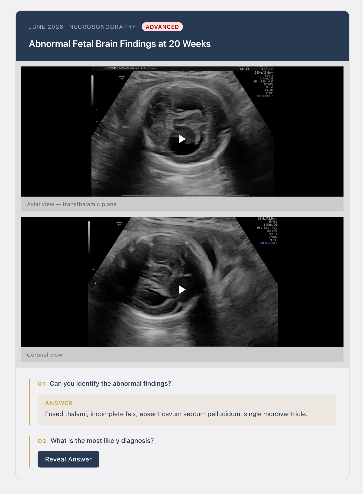
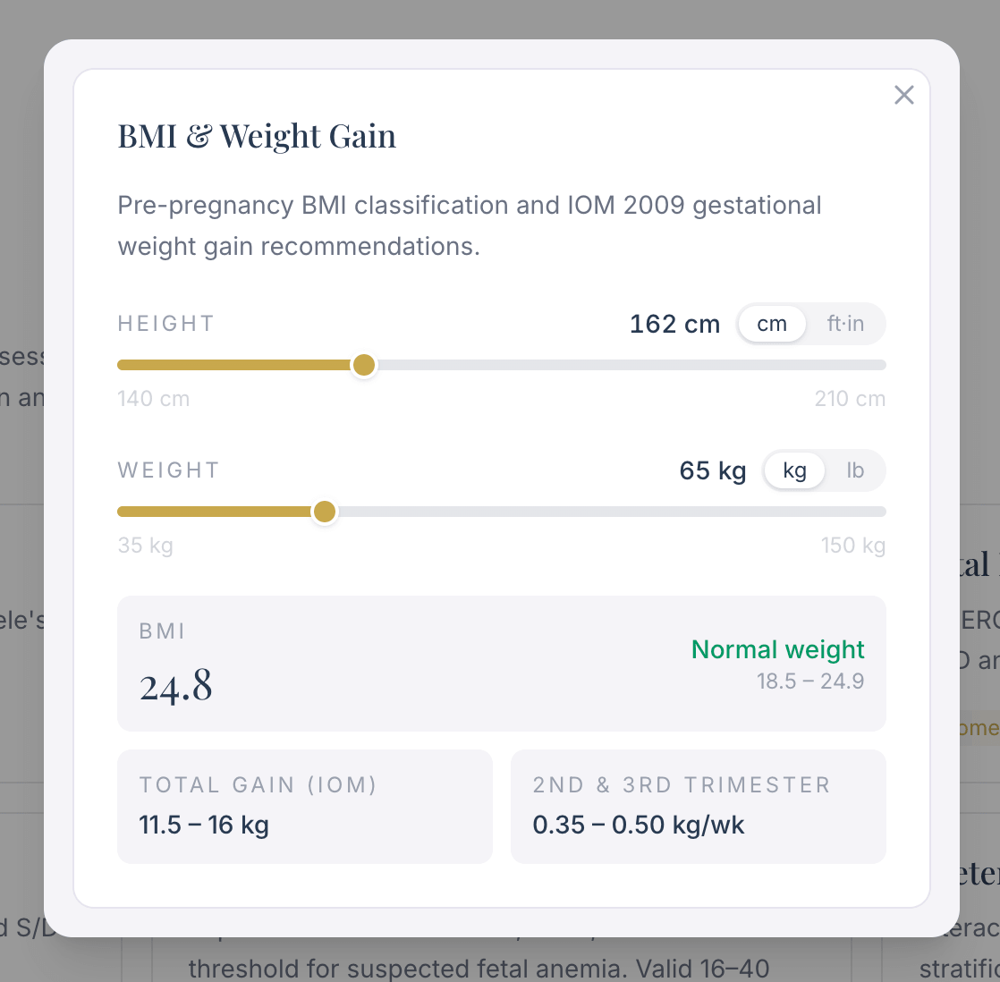
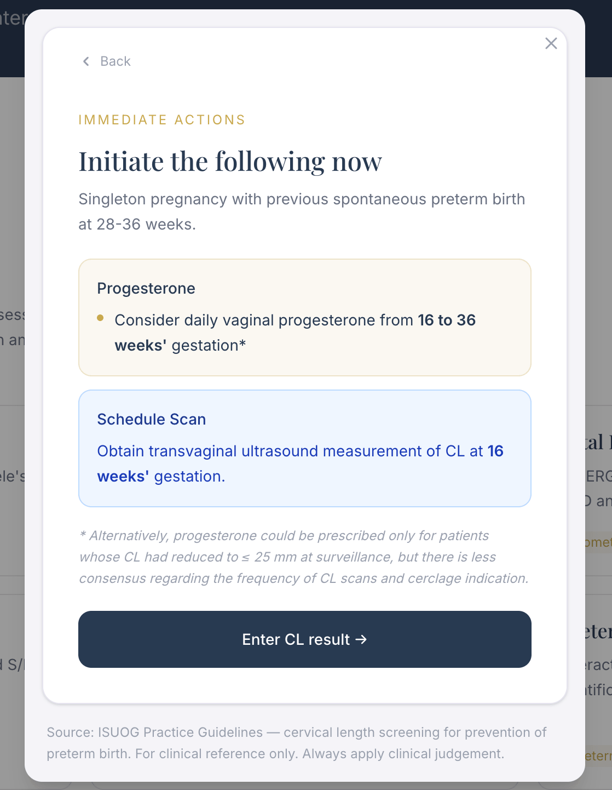

A professional and clinical student facing academic resource platform for Maternal Fetal Medicine in the Caribbean Region. Maternal Fetal Hub provides interactive clinical tools, case-based learning and professional journal articles all in one place

### Accomplishments
- Widespread adoption as the standard resource for calculators for the Fetal Medicine clinics at San Fernando General Hospital

### Key features:

- Interactive clinical assessment tools, including INTERGROWTH-21st growth chart visualisations and Doppler waveform tools.
- Clinical Corner — a case-based learning module featuring a monthly rotating case with multi-step reveal logic (React island).
- Fully responsive and installable PWA that doctors can easily use in a clinical setting.
